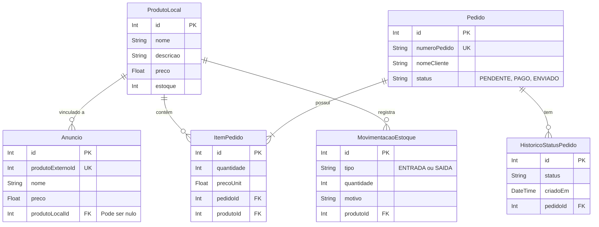

# ShopFlow

Este é o repositório do ShopFlow, um sistema que desenvolvi para gerenciar produtos locais e simular a integração com um marketplace externo. O projeto permite importar anúncios, vincular produtos, controlar o estoque e gerenciar o status de pedidos.

## Sobre a Integração (DummyJSON)

Para simular o funcionamento de um marketplace real sem precisar de contas de vendedor, eu integrei o sistema com a API pública do DummyJSON (https://dummyjson.com). 

Quando você clica em "Importar do Marketplace" no frontend, a nossa aplicação faz uma requisição para essa API externa para buscar uma lista de produtos de teste. Isso permite simular todo o fluxo de importar um anúncio de fora e salvá-lo no nosso banco de dados, para depois vincular com o estoque local.

## Tecnologias Utilizadas

No backend:
* Node.js com Express para criar a API.
* Prisma ORM para facilitar a comunicação com o banco e a criação das tabelas.
* PostgreSQL rodando via Docker.

No frontend:
* React e Vite para construir a interface de forma rápida.
* Axios para fazer as requisições HTTP para o backend e para o DummyJSON.

## Funcionalidades

* Produtos Locais: Cadastro, edição e controle da quantidade em estoque.
* Anúncios: Importação de anúncios de fora e listagem no painel.
* Vinculação: Um único Produto Local pode ser vinculado a vários Anúncios diferentes.
* Movimentação de Estoque: Sempre que um produto é criado ou o estoque é editado manualmente, o sistema salva um registro de "Entrada" ou "Saída".
* Pedidos: Listagem dos pedidos, visualização dos itens e alteração de status (Pendente, Pago, Enviado).

## Diagrama do Banco de Dados

Criei este diagrama para mostrar como estruturei as tabelas e os relacionamentos no Prisma:



## Como rodar o projeto na sua máquina

Siga as instruções abaixo para subir o ambiente local:

### 1. Banco de Dados

Você precisa ter o Docker instalado. Na pasta principal do projeto, suba o contêiner do banco:

```bash
docker-compose up -d

```

### 2. Backend

Abra o seu terminal, entre na pasta do backend e instale as dependências do Node:

```bash
cd backend
npm install

```

Sincronize as tabelas do banco de dados usando o Prisma:

```bash
npx prisma db push

```

Inicie o servidor (ele vai rodar na porta 3000):

```bash
npm run dev

```

### 3. Frontend

Abra um novo terminal, entre na pasta do frontend e instale as dependências:

```bash
cd frontend
npm install

```

Inicie a aplicação React:

```bash
npm run dev

```

O terminal vai gerar um link local. É só clicar nele para abrir o sistema no seu navegador.
